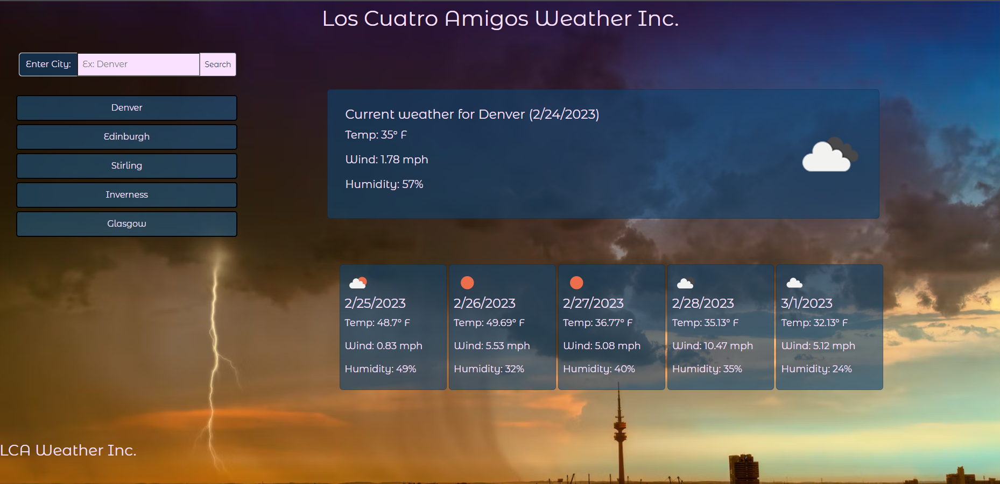

# LosCuatroAmigosWeatherDashboard

## Description

This is a website which will show you the current weather of a city and a five day forecast for that city. It will also save your search results in a column on the left, below the search bar, so that you can easily refer to past cities in case you want to look at your weather inquiry history.

## Usage

Input a city into the search to see it's current weather and a five day forecast. If you search a city name that is not found you will be prompted to enter a valid city name. Here is a screenshot of the website:

Here is a link to the website:

### API

https://openweathermap.org

### Collaborators:

Bobby Simpson https://github.com/therealsweven  
Francisco Gutierrez Rodarte https://github.com/FranciscoGtzRodarte  
Jacob Thorne https://github.com/JThorneX  
Samuel Friedman https://github.com/reverofsuturb
